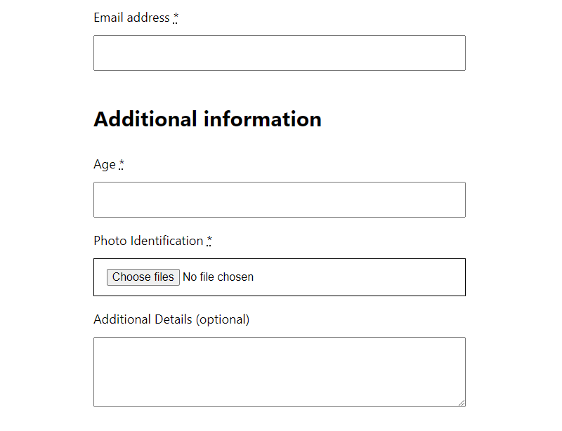
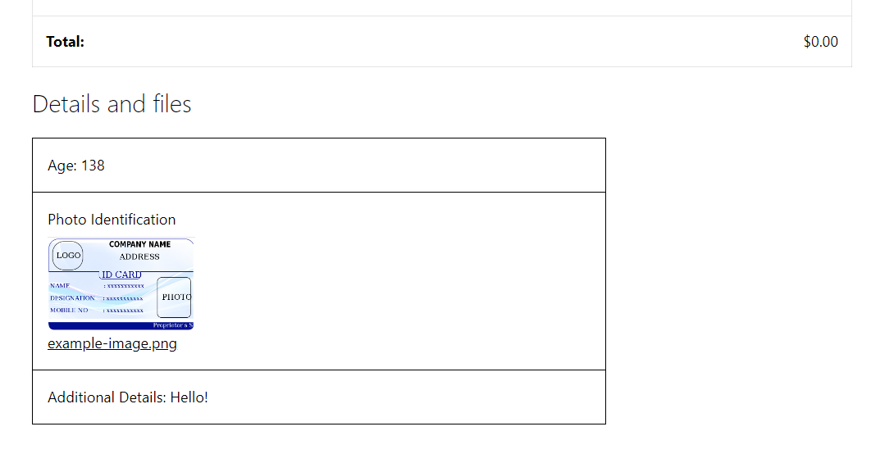
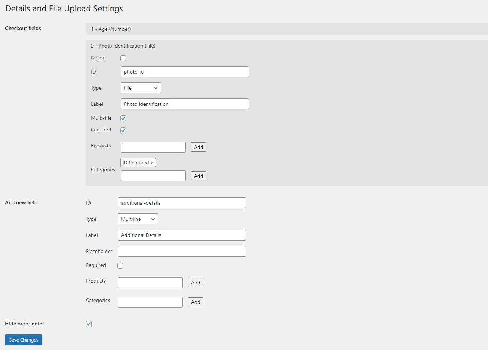

<!-- This file is generated by bin/build-readme.py -->

# Checkout Fields and File Upload for WooCommerce

Easily add general or item-specific detail inputs and file uploads to the WooCommerce checkout page's additional information section.

## Description

Checkout Fields and File Upload for WooCommerce allows you to easily add custom fields to the WooCommerce checkout.

### Product-Specific Fields

These fields can be configured only to appear when specific items or categories of items are in the cart or to appear for all items. When enabled, fields are added to the to the WooCommerce checkout field above the order notes field.

### Multiple Input Types

You can add custom input fields of a multitude of different types include text, multiline, date, password, number, file, and more!

### Secure File Uploads

Files are uploaded to a secure directory and are given a randomly generated name to prevent unauthorized access.

## Installation

PHP 7.0 or greater is required (PHP 8.0 or greater is recommended)

1. Upload the `fields-and-file-upload` folder to your plugin directory
2. Activate the plugin through the \'Plugins\' menu in WordPress

## Screenshots

 Custom fields in the WooCommerce checkout.

 Custom field responses on the order confirmation page.

 The settings page to manage custom fields.

## Developing

### Installing dependencies

Composer is used to install dependencies. Once it is installed run `composer install` to install them.

### Running tests

Tests are run with a installation of WordPress, WooCommerce, and the WordPress test tools. These can be installed with `bin/install-wp-tests.sh [DATABASE NAME] [DATABASE USER] [DATABASE PASSWORD]`. This script requires Subversion to be installed. Once installed, run `composer run tests` to run tests.

### Code sniffing

Run `composer run phpcs` to run the code sniffer. Run `composer run phpcs:full` for a full breakdown of what errors occurred and `composer run phpcs:fix` to fix any auto-fixable errors.

### Generating readme

README.md, readme.txt, and the comment of fields-and-file-upload.php are all generated by running `bin/build-readme.sh`. This script requires Python and PIP to be installed. The data to populate these files is located in the data file `readme-template.yml` and the script `bin/build-readme.py`.

### Creating ZIP archive

Run `bin/build-zip.sh` to create a ZIP archive of the plugin that is suitable to be uploaded to a WordPress site.

### Publishing to wordpress.org

Run `bin/release-svn.sh` to create a release version and add it as a tag to SVN. Run `bin/update-svn-assets.sh` to update wordpress.org assets only. You can specify your SVN username with "--username USERNAME".

## Compatibility

Requires WP version 4.6 and PHP version 7.0.

## Changelog

### 1.2.0

- Require value when adding to list input on the settings page
- Show message when there are no fields on the settings page
- Wrap output in a section tag
- Improve order received page styling
- Show meta box for HPOS orders
- Stop adding extra dot to generated file names
- Add a clear button to the file input
- Add "cffu-table-title" class to response table titles
- Add option to customize response table title
- Don't save empty response meta data and file submissions
- Add prefix to checkout page inputs

### 1.1.7

- Allow fields to be displayed when the WooCommerce cart is undefined.
- Add spacing borders to the WooCommerce details page.

### 1.1.6

Made plugin labels on the admin dashboard more concise.

### 1.1.5

Only calculate allowed MIME types once.

### 1.1.4

Fixed an error on the settings page.

### 1.1.3

- Changed name to "Checkout Fields and File Upload for WooCommerce".
- Implemented changes recommended by the WordPress plugin review team.

### 1.1.2

- Permit custom file types.
- Fixed an issue with adding an item to an empty list on the settings page.

### 1.1.1

Default list settings to use an array.

### 1.1.0

Added file type filtering for uploads.

### 1.0.2

Corrected version numbers.

### 1.0.1

Cleanup plugin data during uninstall.

### 1.0.0

Initial release.
